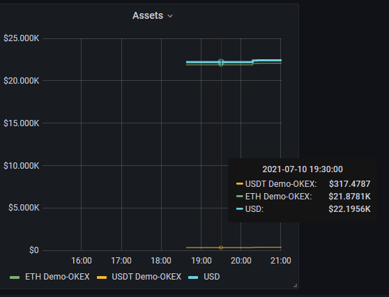

# Cyclic grid strategy based on martingale

## The motto of the project

**_Profitable, fault-tolerant, adaptable to the market. Started and forgot._**
*Don't forget to pick up what you earned.*

Regardless of any trend, exchange overloads, network connection lost, hardware fault.

## Disclaimer

All risks and possible losses associated with use of this strategy lie with you.
Strongly recommended that you test the strategy in the demo mode before using real bidding.

## Initial setup

All information and setup parameters at the top of martin_scale.py

## Reference

[Trade idea](#trade-idea)

[Functionality](#functionality)

[How it's work](#how-its-work)

[Planned](#planned)

[Tested](#tested)

[NOT Tested](#not-tested)

[Known issue](#known-issue)

[Target](#target)

[Referral](#referral-code)

Communication with the author and support in [margin group on Discord](https://discord.com/channels/600652551486177292/601329819371831296)

## Trade idea
Create a grid of increasing volume orders and when they perform
creation of one take profit order in the opposite direction.

Its volume is equal to the sum of the executed grid orders,
and the price compensates the fee and provides the specified profit.

What is the chip? After each grid order executed, the price of the take profit order
approaches the price of the grid, which requires less bounce to perform it.

If all grid orders filled, then reverse and start the cycle in another direction.
The price overlap set for the reverse cycle grid provides a given profit for the initiating cycle.

For Reverse cycle there are only two possible result depending on the price in the market.
In the first case the entire grid executed therefore we close the previous cycle with profit.
In second case executing part of the grid orders, and the filling take profit order increase the depo in the second coin.
It reduces the necessary price overlap and sooner or later first variant comes true.

This allows you to increase the initial deposit using price fluctuations in any trend,
and makes this strategy really break even. Unless you trade scam shitcoin.

In the cycle to sell, the profit accumulates in the first currency.
In the cycle to buy, the profit accumulates in the second coin.

The optimal pair choice is a stablecoin or fiat plus a coin from the top ten.

## Functionality
* Create grid and take profit orders
* Logarithm price option for grid orders (customizable)
* Reverse algo if all grid orders are filling
* Calculation of the price overlap for the Reverse cycle for the profitable completion of the previous cycle
* Use Average Directional Index indicator for best time starting Reverse cycle
* Calculation of separate MAKER and TAKER fee
* Shift grid orders (customizable) if the price is go way (before take profit placed) 
* Fractional creation of grid for increase productivity (customizable)
* Adaptive overlap price for grid on current market conditions (customizable) based on Bollinger Band
* Adaptive profit setting on current market conditions (customizable) based on Bollinger Band
* Adaptive grid orders quantity for initial and Reverse cycle
* Save funding change, cycle parameter and result in sqlite3 .db for external analytics (not for Windows ver. now)
* Telegram notification
* External control from Telegram bot (now **stop** command realised)
* Restore state after hard restart

## How it's work
_Setup all mentioned parameter at the top of martin_scale.py_

### Place grid
The main parameters for the strategy are grid parameters. Specify the trade direction for the first cycle.
If START_ON_BUY = True, a grid of buy orders will be placed and take profit will be for sale.

Specify the deposit size for the first cycle in the desired currency, and the number of grid orders.
These are related parameters, there is a limit on the minimum size of the order,
so a many orders if the deposit is insufficient will not pass the verification during initialization.

The size of the order in the grid calculated according to the law of geometric progression,
while the MARTIN parameter is a coefficient of progression.
The first order, the price of which is closest to the current one is the smallest in volume.

To avoid the execution of the first order "by market," its price set with a slight offset,
which is determined by the parameter PRICE_SHIFT.

#### Shift grid orders
It happens that when place a grid, the price goes in the opposite direction. There is no point
in waiting in this case, we need to move the grid after the price.
For this there are SHIFT_GRID_DELAY. Configure them or leave the default values.

#### Adaptive overlap price for grid
The range of prices that overlaps the grid of orders affects profitability directly 
and must correspond to market conditions. If it is too wide combined with small number of orders,
the cycle time will be too long, and most of the deposit will not be involved in turnover.
With a small overlap, the entire order grid will be executed in a short time, and the algorithm will be reversed,
while the profit on the cycle not fixed.

The overlap range can be fixed. Then it is defined by OVER_PRICE = xx and ADAPTIVE_TRADE_CONDITION = False.

For automatic market adjustment, ADAPTIVE_TRADE_CONDITION = True. In this case, the instant value
of the Bollinger Band on 20 * 1 hour candles used to calculate the overlap range. The minimum values
are limited by the exchange limit for minimal price change per one step combined with number of orders.

For fine-tuning separately for Buy and Sell cycles there are KB and KT parameters. By default, value
2.0 is used to calculate Bollinger curves.

The over price value updated before the start of the new cycle.

#### Quantity of grid orders
Two parameters determine the number of orders, ORDER_Q and OVER_PRICE. For start cycle and parameter
ADAPTIVE_TRADE_CONDITION = False, these are absolute and fixed values.

For Reverse cycle or parameter ADAPTIVE_TRADE_CONDITION = True they specify the density of grid orders.
At the same time, the larger the range of overlap, the more orders there will be.
When calculating, the exchange's restrictions on the minimum order size and price step taken into account
and thus limit the maximum number of orders.

For Reverse cycle, this is especially important, since with large price fluctuations we will have to sweep
a very large range, 30-50% or more. In which case an adaptive number of orders will allow to do this as efficiently
as possible.

#### Fractional creation of grid
For successful trading, the speed of the bot response to price fluctuations is important.
When testing on Bitfinex, I noticed that when placed a group of orders,
the first 5 are placed quickly, and the remaining ones with a significant delay. Also, the more orders,
the longer it takes to shift the grid.

Therefore, I added the parameter GRID_MAX_COUNT, which specifies the number of initial orders to be placed.
Then, two options performed. First, the grid shift function triggered. Second, one of the placed grid orders executed,
and after successful creation of the take profit order, the next part *GRID_MAX_COUNT of hold grid orders added.
If total count of active grid orders more than ORDER_Q and hold grid not exhaust each next placed one
after filling one grid order, until the hold list exhausted.
 
Thus, we always have a given number of active orders to respond to price fluctuations and have a large range
of price overlap. Then, we do not risk running into the ban from exchange for exceeding the limit.

#### Logarithm price option
You can increase the share of the deposit in turnover when calculating the price for grid orders using not a linear,
but a logarithmic distribution. The density of orders near the current price will be higher,
which increases the likelihood of their execution.

Use LINEAR_GRID_K parameter and see 'Model of logarithmic grid.ods' for detail.

#### Reverse
It happens that all grid orders completed. Then we believe that we successfully bought the asset,
and place a take profit order. Instead of one order, we place a grid, which ensures the break-even strategy.
The grid parameters change dynamically, depending on the market conditions, accumulated deposit
during execution of the Reverse cycle, and the specified profitability parameters.

With each successful completion of the reverse cycle, the accumulated profit volume increases,
which reduces the necessary price overlap for the profitable completion of the original cycle.

### Place take profit
As the grid orders executed, the volume of the take profit order sums up their volume,
price averaged and increased to override the fees and earn the specified profit.

Do not set PROFIT too large. This reduces the probability of executing a take profit order
with small price fluctuations. I settled on a value of about 0.5%

For adaptive calculate profit before place order you can set PROFIT_MAX.
Then its value will be set in the range from PROFIT to PROFIT_MAX. Calculation based on Bollinger Band
indicator with PROFIT_K coefficient. 

#### Restart
When take profit order executed the cycle results recorded, the deposit increased by the cycle profit,
and bot restarted.

### Fee options
To correctly count fees for MAKER and TAKER, you must set the custom fee level = 0.0% in
the margin settings and set the FEE_MAKER and FEE_TAKER parameters.

For a third currency fee, such as BNB on Binance, set FEE_IN_PAIR = False

For fee processing for second currency only, like as KRAKEN, use FEE_SECOND = True

Priority of parameters from smaller to larger is:
* FEE_SECOND
* FEE_IN_PAIR

### Telegram notification
Basic information about the state of the bot, for example, about the start and results of the cycle,
can be sent to Telegram bot.

+ Create Telegram bot
+ Get token and channel_id for your bot
+ Specify this data into cfg.py

### Telegram control
To stop the bot for maintenance or in other cases, it is necessary to send the bot a command
to complete the cycle and stop.

+ Check the owner and run permission for get_command_tlg.py
+ Try start it from terminal, if any error - fix it.
+ If it started successfully, check passed, stop it from any process manager.
+ When strategy started, you can send stop command from Telegram.
  In Telegram bot select message from desired strategy and Reply with text message 'stop'
  When strategy ends current cycle it not run next, but stay holding for manual action from
  margin interface. Only 'stop' command implemented now.

### Save data for external analytics
All data collected into funds_rate.db

Cycle time, yield, funds, correlation with cycle parameters,
all this for all pairs and exchanges where this bot launched.

It Sqlite3 db with very simple structure, in table t_funds each row is the result of one
cycle with parameters and result.

Now I'm try use [prometheus](https://github.com/prometheus/client_python) -> [Grafana](https://grafana.com/)
for calculate and visualisation analytic data. It's useful. You can use funds_rate_exporter.py for start.
Find it into repository. 

Also, you can try the grafana_config.json as example of consolidated report.

#### Consolidated asset valuation
If you have several trading pairs on different exchanges, then regular valuation of the asset is a very time-consuming
task.

At the end of each trading cycle, deposit data recorded for each currency. Once a day, the current currency rate to USD
is queried. In funds_rate_exporter.py of times per minute calculated data for unloading in
[prometheus](https://github.com/prometheus/client_python). An example of a summary report implemented on Grafana
located above.

To receive quotes, you need to get the free API key on [CoinMarketCap](https://coinmarketcap.com/api/pricing/).
Specify the key at the top of the funds_rate_exporter.py and start it as service.

### Recovery after any reason crash, restart etc.

* Network failure, timeout etc.

This is margin layer does, and it's work good. No additional action from user needed.

* Hard restart.

Margin periodically, every two seconds, save strategy state, and after restart place strategy in suspend state.
  Strategy check if some order filled out during inactivity and recalculate state for normal operation. You need
  manual unsuspend strategy for further work.

This will work well if, at the time of interruption, the strategy was in a stable state and there were
not pending actions to place/remove orders. Processing such situations requires research,
and I am not sure that it is necessary.
  
* Maintenance

If you need setup new version margin or Python strategy, first you need stop strategy.
Use Telegram control function, described above.

## Planned

## Tested
On margin 4.3.1 Linux, VPS UBUNTU 20.04 2*vCPU 2Gb
Exchange: Demo-OKEX, OKEX, Bitfinex, KRAKEN

+ Volume and price correct for grid and take profit order
+ Reverse work
+ Shift grid
+ Auto overlap price for grid is correct
+ Auto profit calculate
+ Export into funds_rate.db
+ Telegram notification
+ control from Telegram message
+ partially filled order logic
+ Adapt over price
+ Analise trends before start Reverse cycle
+ Adapt grid orders quantity
+ partially placed grid orders

## NOT Tested

- Not tested under Windows and macOS

## Known issue

* In margin not work more than one Python bot at the same time

* Sometimes skips the partial fill signal from the margin layer
* Sometimes fill signal from the margin come with a delay
* Memory leak 

* Some function can not be use under Windows. I faced a problem use sqlite3 module
  in margin environment under Windows. You can try or resolve it.

   * Telegram control
   * Collection cycle data for external analytics

## Target
* Extended testing capabilities
* Optimization ideas
* Several users raise reaction from margin support
* Resources for development
* Get fault tolerance profitable system

## Referral code
For 10% discount on [margin](https://margin.de) license and support this project you can use coupon code **Margin9ateuE**

Also, you can start margin on [Hetzner](https://hetzner.cloud/?ref=uFdrF8nsdGMc) cloud VPS only for 5.88 € per month
